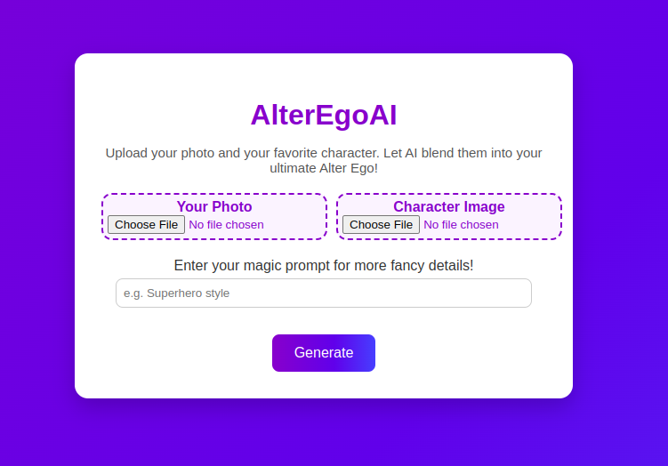
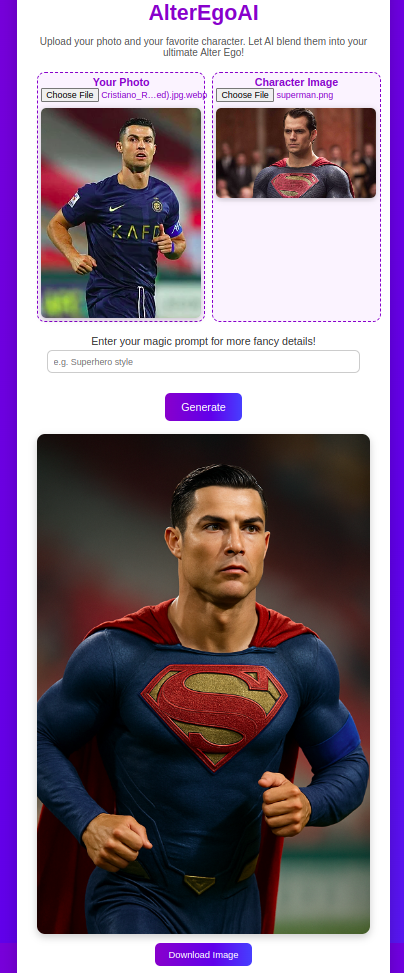
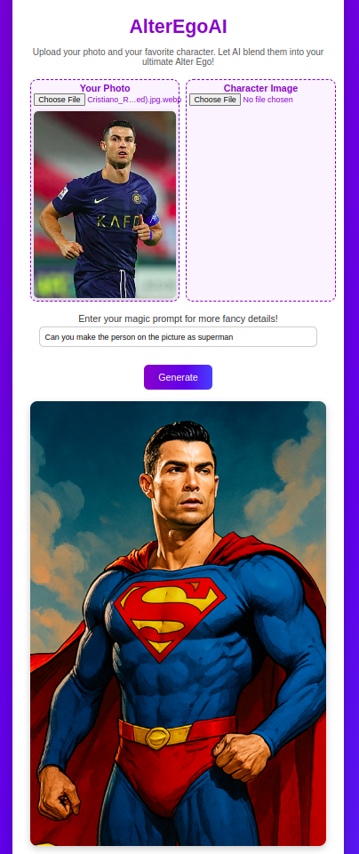

# AlterEgo AI

**Table Of Contents**
- [Description](#description)
- [How does this Web app work?](#how-does-this-web-app-work)
- [Running the app](#running-the-app)

## Description
AlterEgo AI is Web application that use OpenAI GPT-1-Image model to transform you into favorite character (superhero, anime, celebrity), you can use it as to generate your alter ego or as a classic image generator using the prompt



## How does this Web app work?

### Generate your alter ego with two images
You need upload on **Your image** a picture of you or someone else and in **Character image** upload your favorite character, once done, hit **Generate**



### Generate your alter ego with an image and prompt
You need upload on **Your image** a picture of you or someone else and add a specific prompt for more detail, note that you can also add any image and edit with the gpt-1-image model


## Download the generated image
You can simply dowload the generated image by hitting the button **Download**


## Running the app
### Manually

Install the requirements
```
$ pip3 install -r requirements.txt
```

Run the app
```
# Clone the git repo
$ git clone git@github.com:Chakib08/AlterEgoAI.git
# Checkout main branch 
git checkout main
# Run app
$ cd AlterEgoAI/
$ touch .env && echo "OPENAI_API_KEY=your_key_here" > .env
$ python3 src/app.py
```

### Using venv
Run the commands below
```
# Clone the git repo
$ git clone git@github.com:Chakib08/AlterEgoAI.git
# Checkout main branch 
git checkout main

# In Linux
$ cd AlterEgoAI/
# Run setup script
$ source scripts/linux/setup.sh
$ touch .env && echo "OPENAI_API_KEY=your_key_here" > .env
$ python3 src/app.py

# In Windows
$ cd AlterEgoAI/
# Run setup script
$ scripts/windows/setup.bat
$ touch .env && echo "OPENAI_API_KEY=your_key_here" > .env
$ python3 src/app.py
```

### Using prebuilt docker image
Pull the docker image and run the container
```
# Pull the image
$ docker pull mohamedlaminek/alterego-ai:latest
# Export your OpenAI API key
export KEY="<your_key_here>"
# Run the docker container
$ docker run -p 5000:5000 -e OPEN_API_KEY=KEY mohamedlaminek/alterego-ai
```

### Usage
Use `http://127.0.0.1:5000` for local usage

```
 * Serving Flask app 'app'
 * Debug mode: off
WARNING: This is a development server. Do not use it in a production deployment. Use a production WSGI server instead.
 * Running on all addresses (0.0.0.0)
 * Running on http://127.0.0.1:5000
 * Running on http://172.17.0.2:5000
 ```